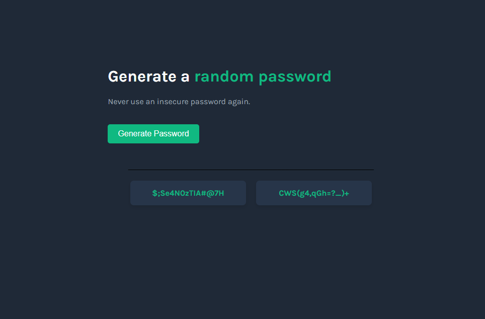

# Random Password Generator

A clean, minimal web app that generates secure random passwords — built with vanilla HTML, CSS, and JavaScript.

---

## Features

- Generates two unique random passwords simultaneously
- Single-click generation via a styled button
- Passwords displayed in styled card containers for easy reading
- Fully responsive layout centered on the page

---

## Built With

- **HTML5** — Semantic structure
- **CSS3** — Custom styling with no frameworks
- **JavaScript (Vanilla)** — Password generation logic and DOM manipulation

---

## Skills Showcased

- CSS & Layout
- Typography
- JavaScript
- UI/UX Design Principles

---